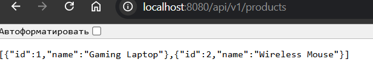
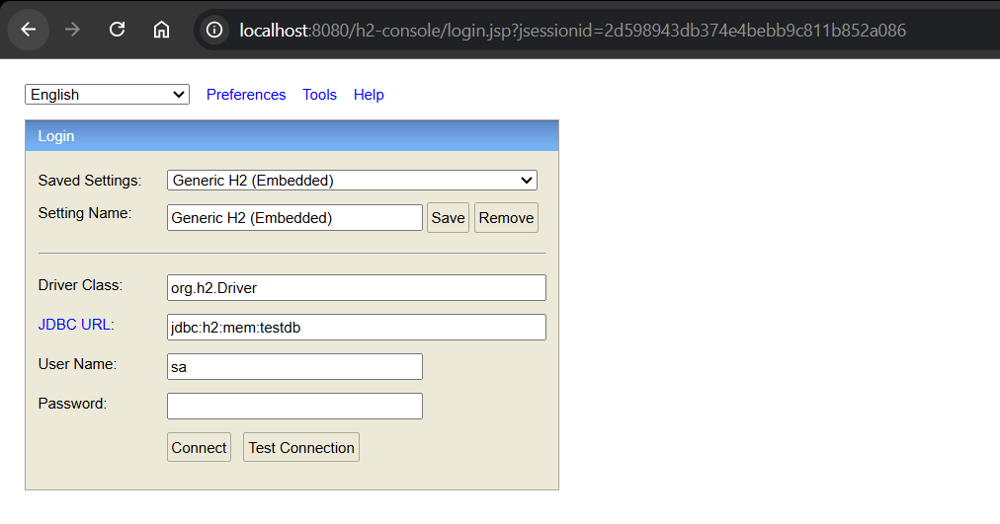
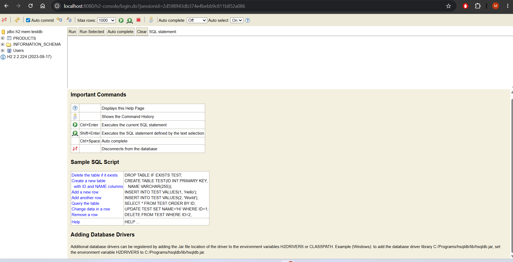

# Spring Boot REST API - Task 2

This project is a RESTful API built with Spring Boot, Spring Data JPA, and an in-memory H2 database.

## Technologies Used
* Java 21
* Spring Boot (Web, Data JPA)
* H2 In-Memory Database

## API Endpoints
The main endpoint for managing products is `/api/v1/products`. Upon application startup, initial data is automatically loaded into the database using a `CommandLineRunner`.

### 1. GET All Products
* **URL:** `http://localhost:8080/api/v1/products`
* **Description:** Returns a list of all products in JSON format.
* **Result:**
  

### 2. H2 Database Console
* **URL:** `http://localhost:8080/h2-console`
* **Description:** The embedded H2 database console showing the automatically generated `PRODUCTS` table.
* **Result:**
* 
* 
* 